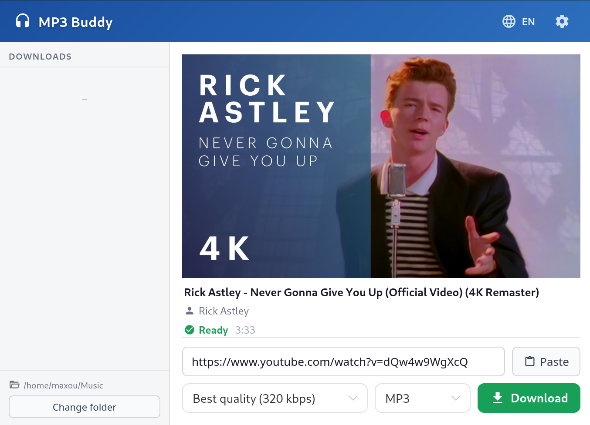

# MP3 Buddy

**A simple desktop app for downloading music from the web.**

Works with YouTube, SoundCloud and [1000+ other sites](https://github.com/yt-dlp/yt-dlp/blob/master/supportedsites.md).

> [!NOTE]
> MP3 Buddy comes with an optional **browser extension** that lets you send a video to the app
> directly from your browser, in one click. See [`browser-extension/README.md`](./browser-extension/README.md).

---

## Getting started

### 1. Install

Download the latest version for your system from the
[**Releases page**](https://github.com/MaximeSahuc/mp3-buddy/releases):

| Platform | File |
|----------|------|
| Windows  | `.exe` installer (or `.msi`) |
| Linux    | `.AppImage` / `.deb` / Other |
| macOS    | `.dmg` |

> [!TIP]
> If a video asks you to log in (age-restricted, private, or members-only), add your cookies in
> **Settings → Cookies**. The easiest way is the [browser extension](./browser-extension/README.md),
> which sends the right cookies for you automatically.

## Browser extension

MP3 Buddy ships with a companion browser extension (Chrome / Edge / Brave / Vivaldi). It adds a
button that sends the current page - and the cookies needed to download it - straight to the app.

👉 **Full setup and usage instructions:** [`browser-extension/README.md`](./browser-extension/README.md)

## For developers

Want to build MP3 Buddy from source or contribute? See the
**[Development guide](./DEVELOPMENT.md)** for the tech stack, setup steps, and commands.

## License

[MIT](LICENSE)

This project is a fork of [imsyy/yt-dlp-gui](https://github.com/imsyy/yt-dlp-gui).
</content>
</invoke>
